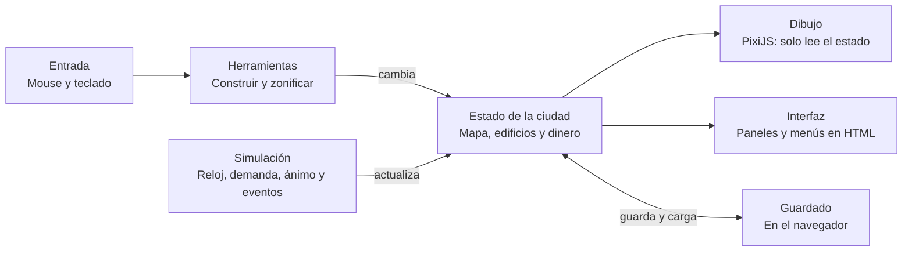

# Plan de acción: juego de gestión de ciudades isométrico

Fecha del plan: 2026-10-09

## Resumen

Un juego de gestión de ciudades en tiempo real, con vista isométrica, que se juega en el navegador de la PC. El jugador zonifica, traza carreteras y construye servicios, y la ciudad crece sola. La gente reacciona a los servicios, los impuestos, el entorno y la seguridad. Es un sandbox con hitos, pensado para jugarse durante varias semanas, unas horas por día.

## Decisiones de diseño

Estas decisiones salieron de las conversaciones previas y son la base del resto del plan.

| Tema | Decisión |
| --- | --- |
| Plataforma | Navegador en PC, con mouse y teclado. Autoguardado local |
| Tiempo | Tiempo real, con pausa y velocidades x1, x2 y x3. Sin turnos |
| Motor gráfico | PixiJS v8 + TypeScript + Vite |
| Arte | Sprites isométricos 2D de Kenney (licencia CC0) |
| Construcción | Zonificación residencial, comercial e industrial. Los edificios crecen y mejoran solos |
| Edificios de servicio | Se colocan a mano y se mejoran pagando: hospitales, colegios, universidades, parques, bomberos y policía |
| Luz, agua y gas | Plantas con cobertura por radio |
| Carreteras | Se trazan a mano y conectan las zonas. Una autopista cruza el mapa de borde a borde: es la conexión con el exterior y no se puede demoler |
| Población | Simulación agregada por barrio. Autos y peatones son solo decorativos |
| Ánimo de la gente | Depende de los servicios, los impuestos y el empleo, el entorno y la seguridad |
| Objetivo | Sandbox con hitos y desbloqueos según la población |
| Eventos | Incendios y apagones. Nada más por ahora |
| Idioma | Español |

## Qué instalar y cómo

Solo hace falta Node.js y un comando para crear el proyecto. No hay que instalar ninguna librería de estilos: los menús y paneles se hacen con HTML y CSS planos encima del canvas de PixiJS.

1. Instalar la versión LTS de Node.js desde https://nodejs.org (incluye npm).
2. Verificar la instalación en una terminal con `node -v` y `npm -v`. Ambos deben mostrar un número de versión.
3. Ubicarse en la carpeta de trabajo y crear el proyecto con la plantilla oficial de PixiJS v8 (Vite + TypeScript):

```bash
npm create pixi.js@latest ciudad -- --template bundler-vite
```

4. Entrar a la carpeta, instalar las dependencias y arrancar el servidor de desarrollo:

```bash
cd ciudad
npm install
npm run dev
```

5. Abrir en el navegador la dirección que muestre la terminal. Con Vite suele ser `http://localhost:5173`.

Si la plantilla oficial no funciona, la alternativa es crear un proyecto de Vite y agregar PixiJS a mano:

```bash
npm create vite@latest ciudad -- --template vanilla-ts
cd ciudad
npm install
npm install pixi.js
```

No se instalan librerías de cámara ni de interfaz. La cámara (paneo y zoom) se escribe a mano para evitar incompatibilidades entre versiones de PixiJS. Más adelante se puede sumar `vitest` para probar la lógica de la simulación, pero no hace falta para empezar.

Fuentes:
- Guía de create pixi.js: https://skills.sh/pixijs/pixijs-skills/pixijs-create
- PixiJS con Vite y TypeScript: https://dev.to/mrlinxed/pixijs-setup-with-vite-and-typescript-m6l

## Assets gráficos

Conviene usar los packs 2D isométricos de Kenney, no los "City Kit". Los City Kit (Suburban, Commercial, Industrial y Roads) son modelos 3D, así que habría que renderizarlos a sprites con Blender antes de usarlos. Los packs 2D ya vienen como PNG listos para PixiJS. Todos son de licencia CC0: se pueden usar en proyectos comerciales y no exigen dar crédito.

| Qué | Pack | Contenido |
| --- | --- | --- |
| Edificios | Isometric Buildings #1 (https://opengameart.org/content/isometric-buildings-1) | Piezas modulares de edificios en PNG sueltos de 128 px, más una hoja de sprites |
| Calles y agua | Road and water tiles (https://opengameart.org/content/road-and-water-tiles-from-isometric-set) | 79 tiles de calles, puentes y agua en PNG sueltos, más hoja de sprites |
| Terreno y casas | Isometric City e Isometric Landscape | Complementos de Kenney, que su autor indica como compatibles con el pack de edificios. Se buscan por nombre en https://kenney.nl/assets u OpenGameArt |

Dónde guardarlos dentro del proyecto:

```
public/assets/kenney/buildings/
public/assets/kenney/roads/
public/assets/kenney/terrain/
```

Avisos para no frenarse:

- No hace falta tener todos los assets para empezar. Las etapas 1 y 2 funcionan con casillas dibujadas por código. Los sprites se enchufan después.
- Los packs pueden tener tamaños distintos. En la etapa 1 se verifica la escala de cada uno y, si hace falta, se reescala.
- Autos y peatones se resuelven en la etapa 7. Si no aparecen sprites adecuados, se dibujan con formas simples.

## Mecánicas

Las cifras concretas (costos, radios, capacidades) son propuestas iniciales. Van todas en un solo archivo de datos para poder ajustarlas al probar.

### Zonas y crecimiento

- El jugador pinta zonas residencial, comercial e industrial junto a una carretera.
- Un lote crece cuando hay demanda, servicios cubiertos y espacio libre.
- Los edificios tienen tres niveles: casa chica, casa mediana y edificio. Suben de nivel según el valor del suelo, los servicios y el ánimo del barrio.

### Servicios

- Luz, agua y gas salen de plantas con una capacidad y un radio de cobertura. Cada edificio consume una parte.
- Hospitales, colegios, universidades, bomberos y policía tienen su propio radio. Los parques mejoran el entorno cercano.
- Los edificios de servicio se mejoran a mano pagando. Cada nivel amplía el radio o la capacidad.
- Un mapa de calor por servicio muestra qué zonas quedan sin cubrir.

### Economía

- Ingresos: impuestos de cada tipo de zona, con tasa ajustable.
- Gastos: mantenimiento de calles y de cada edificio de servicio.
- El balance se calcula por mes de juego. Si el saldo queda en negativo, aparece una alerta, y si persiste se reducen servicios.

### Ánimo de la gente

- Es un indicador de 0 a 100, por barrio y para toda la ciudad.
- Suma o resta según cuatro grupos de factores: servicios cubiertos, impuestos y empleo, entorno (parques, contaminación, ruido y tráfico) y seguridad (delincuencia e incendios).
- Un ánimo alto atrae habitantes y sube el valor del suelo. Uno bajo hace que la gente se vaya.

### Incendios y apagones

- Los incendios aparecen al azar y son más probables donde no llega un bombero. Se propagan a casillas vecinas hasta que una estación los apaga.
- Un apagón ocurre cuando la demanda eléctrica supera la capacidad de las plantas. Las zonas afectadas dejan de producir y bajan el ánimo hasta que se restablece el suministro.

## Mapa y progresión

El mapa es de 128 x 128 casillas, es decir 16.384 en total. Es cuatro veces más grande que uno de 64 x 64, y alcanza para varias semanas de juego sin que el rendimiento sea un problema si solo se dibuja lo que se ve en pantalla.

Para estirar la duración, el mapa se divide en 64 sectores de 16 x 16 casillas. Se empieza con 4 sectores contiguos (32 x 32) pegados a un borde del mapa, junto a la autopista, como en Cities: Skylines. El resto se compra, así que la ciudad crece hacia un solo lado siguiendo la autopista. Cada sector cuesta más que el anterior, así que expandirse depende de la economía.

Los hitos desbloquean edificios y herramientas. La población de cada hito es una propuesta inicial:

| Hito | Población | Desbloquea |
| --- | --- | --- |
| Aldea | 0 | Carreteras, zonas residencial y comercial, planta eléctrica, pozo de agua |
| Pueblo | 500 | Zona industrial, planta de gas, bomberos, policía |
| Ciudad pequeña | 2.000 | Colegios, parques, hospital |
| Ciudad | 10.000 | Universidad, nivel 3 de edificios |
| Metrópolis | 50.000 | Mejoras máximas de servicios y logro final |

La velocidad de crecimiento es un único parámetro. Se calibra jugando, hasta que llegar a Metrópolis lleve semanas y no días.

## Arquitectura

El código se organiza alrededor de un único estado de la ciudad. La simulación lo actualiza, las herramientas lo modifican, y el dibujo y la interfaz solo lo leen. Esa separación permite cambiar el aspecto del juego sin romper sus reglas.



### Estructura de carpetas

```
src/
  main.ts          arranque del juego
  core/            estado de la ciudad y tipos de datos
  sim/             reloj, zonas, servicios, economía, ánimo y eventos
  render/          dibujo con PixiJS: mapa, sprites y cámara
  input/           mouse, teclado y herramientas de construcción
  ui/              paneles y menús en HTML y CSS
  save/            guardado y carga
  data/            costos, radios, capacidades y textos en español
public/assets/kenney/   sprites
docs/PLAN.md       este plan
CLAUDE.md          reglas de trabajo para Claude
```

## Plan por etapas

Cada etapa termina con algo jugable y probable. No se pasa a la siguiente hasta que se cumplen sus criterios.

### Etapa 0: preparación

- Node.js instalado y proyecto creado según la sección "Qué instalar y cómo".
- Packs de Kenney bajados y guardados en `public/assets/kenney/`.
- Criterio: `npm run dev` abre una página en el navegador sin errores.

### Etapa 1: mapa isométrico y cámara

- Grilla de 128 x 128 con pasto, agua y árboles.
- Paneo con el mouse, zoom con la rueda y resaltado de la casilla bajo el cursor.
- Sectores bloqueados visibles, solo se dibujan las casillas en pantalla.
- Criterio: se puede recorrer todo el mapa con fluidez y la casilla señalada coincide con el cursor.

### Etapa 2: carreteras, dinero y reloj

- Trazado de carreteras arrastrando, con tiles que se conectan solos en curvas y cruces. Demolición.
- Autopista prearmada de borde a borde que pasa por la zona inicial. En la etapa 3, un lote solo crece si su calle llega a la autopista.
- Barra de herramientas, dinero inicial y costo por construir.
- Reloj de juego con pausa y velocidades x1, x2 y x3.
- Criterio: se arma una red de calles y el dinero baja según lo construido.

### Etapa 3: zonas y crecimiento

- Pintado de zonas residencial, comercial e industrial.
- Demanda por tipo de zona y edificios que aparecen y suben de nivel.
- Población total y por barrio.
- Criterio: una zona con calle y demanda empieza a poblarse sin intervención del jugador.

### Etapa 4: servicios

- Plantas de luz, agua y gas con capacidad y radio. Déficit visible cuando falta suministro.
- Hospital, colegio, universidad, parque, bomberos y policía, con mejora de nivel.
- Mapas de calor de cobertura.
- Criterio: construir o quitar una planta cambia la cobertura y se ve en el mapa de calor.

### Etapa 5: economía y ánimo

- Presupuesto con ingresos por impuestos y gastos de mantenimiento. Tasas ajustables.
- Empleo, ánimo por barrio y ciudad, y migración de habitantes.
- Panel de datos con población, dinero, ánimo y alertas.
- Criterio: subir los impuestos o sacar un servicio baja el ánimo y se nota en la población.

### Etapa 6: eventos, hitos y guardado

- Incendios con propagación y apagones por falta de electricidad.
- Hitos con desbloqueos y compra de sectores.
- Guardado y carga en el navegador, con autoguardado.
- Criterio: se cierra y se reabre la página y la ciudad sigue como estaba.

### Etapa 7: vida y pulido

- Autos y peatones decorativos, y sonido.
- Balance de costos y velocidad de crecimiento, y pantalla de inicio.
- Interfaz completa en español y revisión de rendimiento.
- Criterio: una partida de varias horas se mantiene fluida y el ritmo de crecimiento es el buscado.

## Cómo vibecodearlo

La regla central: una etapa por vez, con una prueba concreta al final de cada una.

1. Guardar este plan en el proyecto como `docs/PLAN.md` y pedirle a Claude que lo lea al empezar cada sesión.
2. Pedir un archivo de reglas. Un `CLAUDE.md` en la raíz con: interfaz en español, TypeScript estricto, simulación separada del dibujo, y todos los números de balance en `src/data/`.
3. Pedir una etapa por mensaje. Al final de cada una, Claude debe decir exactamente qué probar y qué esperar ver.
4. Usar git desde el inicio. Un commit por etapa terminada permite volver atrás si algo se rompe. Si no se sabe usarlo, pedirle a Claude que lo configure y lo haga.
5. Probar siempre dos cosas: que `npm run dev` muestre lo que se pidió, y que `npm run build` termine sin errores de tipos.
6. Reportar lo que se ve, no lo que se supone. Una captura de pantalla y el texto de la consola valen más que una descripción.

Mensaje modelo para arrancar la etapa 1:

```
Leé docs/PLAN.md y CLAUDE.md. Vamos con la Etapa 1: mapa isométrico y cámara.
Usá casillas dibujadas por código por ahora, sin sprites.
Al terminar, explicame cómo probarlo y qué criterio de la etapa cumple.
No avances a la Etapa 2.
```

## Fuera de alcance por ahora

Estas ideas quedan para después de la etapa 7, para no saturar el juego:

- Versión móvil y controles táctiles.
- Desastres naturales como inundaciones o terremotos.
- Ciudadanos individuales con casa, trabajo y ánimo propios.
- Relieve y alturas en el terreno.
- Préstamos, ordenanzas y otros ajustes de presupuesto avanzados.
- Transporte público, trenes y aeropuertos.
- Multijugador.
